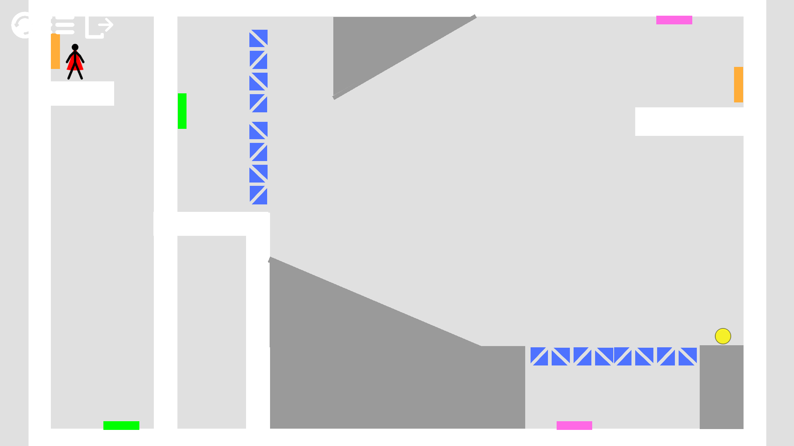
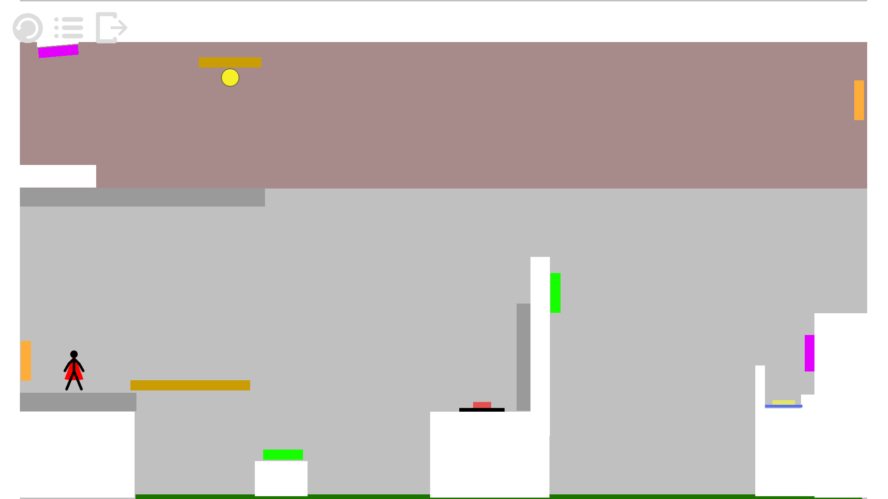

# One Door Away

## Introduction

You wake up in a strange place forgetting everything. You do not know where here is and forget who you are. You try to follow the sound of sea waves and want to get out of the room.

Luckily, you can shoot portals to assist you. With the portals, you are able to transfer yourself or other objects from one place to another!

During the journey escaping, you find some memory fragments and recall some past memory about yourself. There seems to have something hidden about yourself and you need to figure it out...

This is an interesting **2D puzzle** game. Enjoying solving the puzzles, and hopefully, you can find out the truth about yourself!

## Demo

Demo videos can be found follow this link: https://www.bilibili.com/video/BV1Z3411x7b4

## Download

Executable can be found in [**Release**](https://github.com/Timothy-197/OneDoorAway/releases).

Demo videos of our game are also provided in the release page.

## Environment

Developed by **Unity 2019.4.5f1**.

## Developers

**Design**

* [Yifan Zhao](https://github.com/Fantendo2001)

**Program**

* [Honghao Chen](https://github.com/Chen-Gary)
* [Yiyan Hu](https://github.com/Timothy-197)

